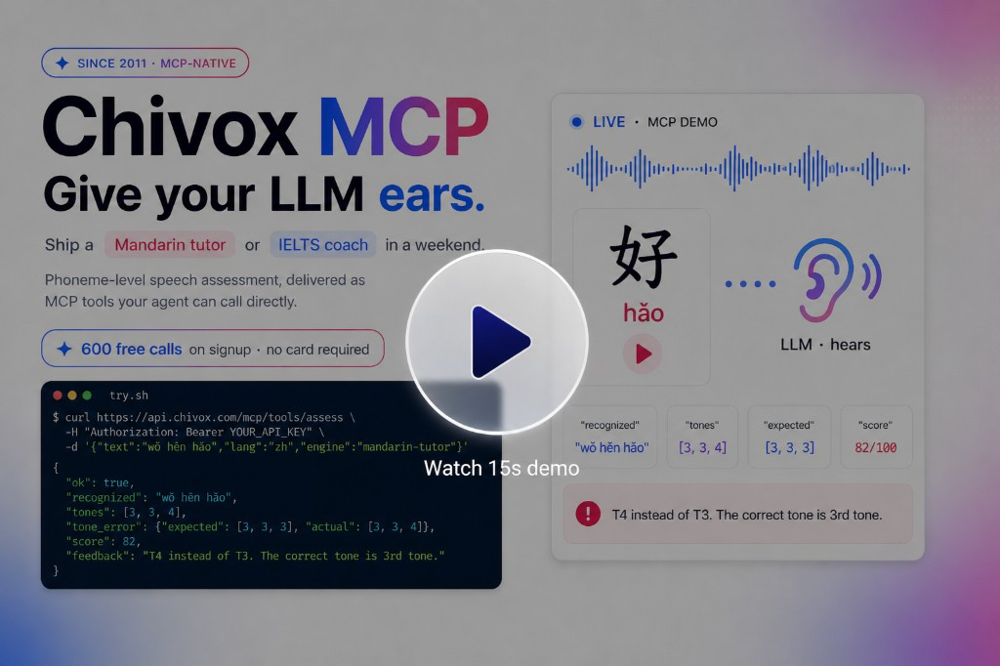
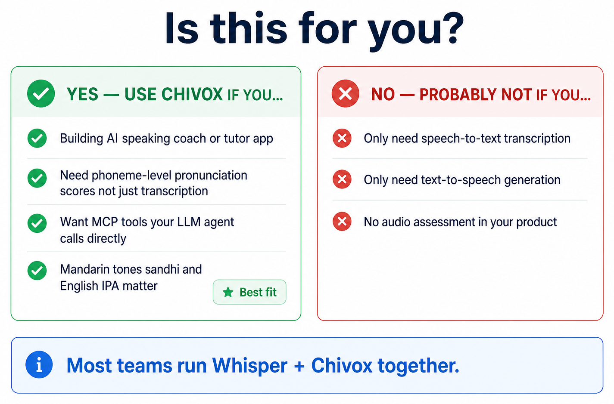
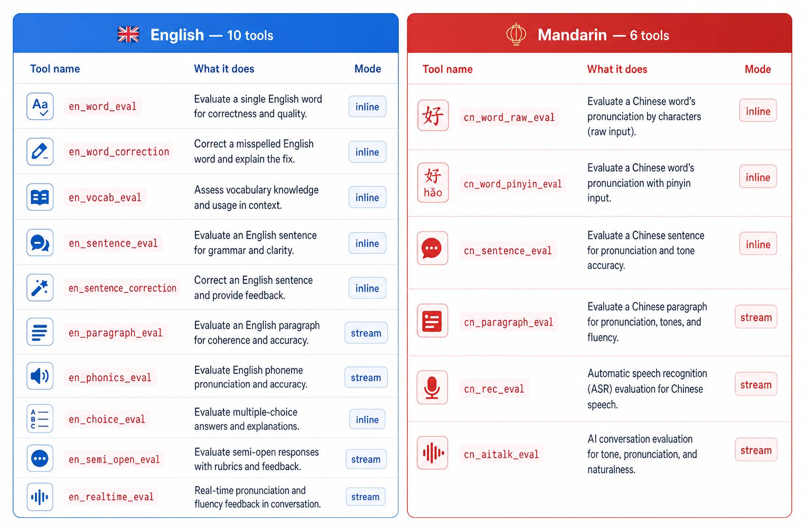
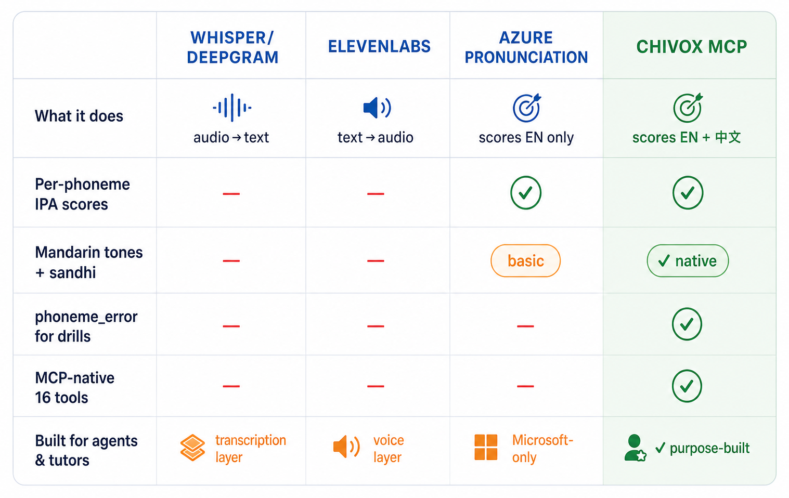
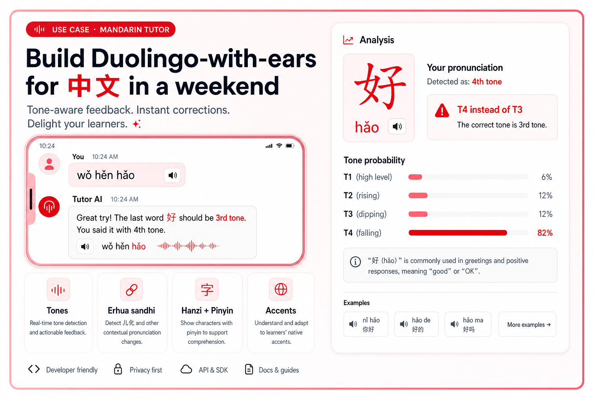
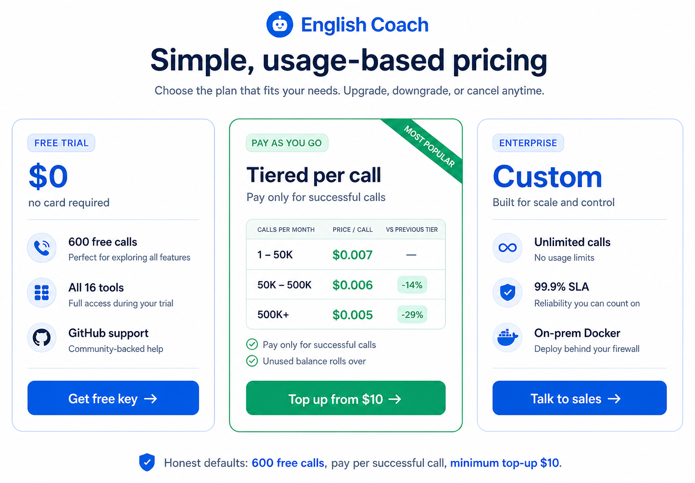

<div align="center">



<br/>

<video src="https://github.com/chivox-developer/chivox-speech-eval-mcp/raw/main/assets/chivox-mcp.mp4" controls width="720">
  Your browser does not support the video tag.
</video>

<br/>

<a href="https://api-portal.cloud.chivox.com/docs"></a>
&nbsp;
<a href="#-quickstart"></a>

<br/>


<br/>


</div>

> **TL;DR** — LLMs can't hear audio. **Chivox MCP** is a hosted MCP server that scores pronunciation at the phoneme level — Mandarin tones included. One `tools/call` returns `overall / accuracy / pron / fluency / details[].phone[]` in a stable JSON shape your model can reason over. Not STT. Not a Whisper wrapper.

[English](#english) | [中文](#中文)

---

## English

### 🎯 Is this for you?

<p align="center">
  
</p>

> Most production teams run **Whisper + Chivox together**: Whisper to transcribe what was said, Chivox to score how well. They don't compete.

### What is this?

Chivox Speech Evaluation MCP Server exposes professional speech assessment capabilities as [Model Context Protocol (MCP)](https://modelcontextprotocol.io/) tools. Connect your AI assistant to our cloud service and let it evaluate pronunciation quality for English and Chinese.

**Service endpoint:** `https://mcp-global.cloud.chivox.com`

### Features

- **16 evaluation tools** — word, sentence, paragraph, phonics, real-time reading, and more
- **English + Chinese** — 10 English tools, 6 Chinese tools
- **Real-time streaming** — WebSocket-based live audio evaluation
- **Multiple audio inputs** — URL, Base64, or file upload
- **Works everywhere** — Claude Desktop, Cursor, and any MCP-compatible client
- **Dual authentication** — B2C (API Key) and B2B (JWT)

### 🚀 Quickstart

Hosted endpoint: **`https://mcp-global.cloud.chivox.com`** · every request needs `Authorization: Bearer <api_key>`. [Get a key →](https://api-portal.cloud.chivox.com)

| Client | Setup |
|--------|-------|
| [**Cursor**](#cursor-zero-install) | `~/.cursor/mcp.json` — IDE MCP, zero install |
| [**LangChain**](#langchain) | LangGraph ReAct agent + MCP adapter |
| [**OpenAI Agents SDK**](#openai-agents-sdk) | `agents.mcp.MCPServerStreamableHttp` |
| [**Claude Desktop**](#claude-desktop) | Local proxy for mic streaming |
| [**Raw MCP SDK**](#raw-mcp-sdk) | Direct `mcp` Python client |

#### Cursor _(zero install)_

```json
// ~/.cursor/mcp.json
{
  "mcpServers": {
    "chivox-speech-eval": {
      "type": "streamable-http",
      "url": "https://mcp-global.cloud.chivox.com",
      "headers": { "Authorization": "Bearer <your_api_key>" }
    }
  }
}
```

#### LangChain

```python
from langchain_mcp_adapters.client import MultiServerMCPClient
from langgraph.prebuilt import create_react_agent

client = MultiServerMCPClient({
    "chivox": {
        "transport": "streamable_http",
        "url": "https://mcp-global.cloud.chivox.com",
        "headers": {"Authorization": "Bearer <your_api_key>"},
    }
})
tools = await client.get_tools()  # discovers all 16 tools

agent = create_react_agent("openai:gpt-4o-mini", tools)
result = await agent.ainvoke({"messages": [(
    "user",
    "Score https://example.com/audio/sentence.mp3, ref: I think therefore I am",
)]})
```

#### OpenAI Agents SDK

```python
from agents import Agent, Runner
from agents.mcp import MCPServerStreamableHttp

chivox = MCPServerStreamableHttp(
    params={
        "url": "https://mcp-global.cloud.chivox.com",
        "headers": {"Authorization": "Bearer <your_api_key>"},
    },
    name="chivox-speech-eval",
)

async with chivox:
    agent = Agent(
        name="coach",
        instructions="Professional speaking coach",
        mcp_servers=[chivox],
    )
    r = await Runner.run(
        agent,
        "Score https://example.com/audio/sentence.mp3, ref: I think therefore I am",
    )
    print(r.final_output)
```

#### Claude Desktop _(mic streaming via local proxy)_

```bash
npm install -g chivox-local-mcp
```

```json
// ~/Library/Application Support/Claude/claude_desktop_config.json
{
  "mcpServers": {
    "chivox": {
      "command": "chivox-local-mcp",
      "env": {
        "MCP_REMOTE_URL": "https://mcp-global.cloud.chivox.com",
        "MCP_API_KEY": "<your_api_key>"
      }
    }
  }
}
```

#### Raw MCP SDK

```python
import asyncio
from mcp.client.streamable_http import streamablehttp_client
from mcp import ClientSession

async def main():
    async with streamablehttp_client(
        "https://mcp-global.cloud.chivox.com",
        headers={"Authorization": "Bearer <your_api_key>"},
    ) as (r, w, _):
        async with ClientSession(r, w) as s:
            await s.initialize()
            out = await s.call_tool("en_sentence_eval", {
                "ref_text": "I think therefore I am",
                "audio_url": "https://example.com/audio/sentence.mp3",
            })
            print(out)

asyncio.run(main())
```

> More clients (Claude Code, Windsurf, Zed, Mastra, function-calling mode) → [docs → Clients](https://api-portal.cloud.chivox.com/docs)

### 🧠 What the LLM actually sees

Every tool returns the **same top-level shape** — switch locale or granularity with zero schema work. Example for *"hello"*:

```json
{
  "overall": 85,
  "accuracy": 82,
  "pron": 88,
  "integrity": 95,
  "fluency": { "overall": 78, "speed": 65, "pause": 2 },
  "details": [
    {
      "char": "hello",
      "score": 85,
      "phone": [
        { "phoneme": "h",  "score": 90, "dp_type": "normal" },
        { "phoneme": "ɛ",  "score": 82, "dp_type": "normal" },
        { "phoneme": "l",  "score": 88, "dp_type": "normal" },
        { "phoneme": "oʊ", "score": 80, "dp_type": "normal" }
      ]
    }
  ]
}
```

For English mispronunciations, `phoneme_error: { expected, actual }` is included. Mandarin adds `tone_ref` / `tone_detected` with sandhi-aware `dp_type` verdicts. [Full field list →](https://api-portal.cloud.chivox.com/docs)

### 🛠️ Tools catalog

<p align="center">
  
</p>

**Inline audio:** pass `audio_url` or `audio_base64` in the tool call — no upload round-trip. **Formats:** mp3 · wav · ogg · m4a · aac · pcm.

#### English Evaluation

| Tool | Description | core_type |
|------|-------------|-----------|
| `en_word_eval` | Word pronunciation scoring | `en.word.score` |
| `en_word_correction` | Word pronunciation correction | `en.word.pron` |
| `en_phonics_eval` | Phonics evaluation | `en.nsp.score` |
| `en_sentence_eval` | Sentence reading assessment | `en.sent.score` |
| `en_sentence_correction` | Sentence pronunciation correction | `en.sent.pron` |
| `en_vocab_eval` | Multi-word evaluation | `en.vocabs.pron` |
| `en_paragraph_eval` | Paragraph reading assessment | `en.pred.score` |
| `en_realtime_eval` | Real-time reading evaluation | `en.rltm.score` |
| `en_choice_eval` | Oral choice evaluation | `en.choc.score` |
| `en_semi_open_eval` | Semi-open question evaluation | `en.scne.exam` |

#### Chinese Evaluation

| Tool | Description | core_type |
|------|-------------|-----------|
| `cn_word_pinyin_eval` | Pinyin pronunciation scoring | `cn.word.score` |
| `cn_word_raw_eval` | Character pronunciation scoring | `cn.word.raw` |
| `cn_sentence_eval` | Sentence reading assessment | `cn.sent.raw` |
| `cn_paragraph_eval` | Paragraph reading assessment | `cn.pred.raw` |
| `cn_rec_eval` | Limited-branch recognition | `cn.rec.raw` |
| `cn_aitalk_eval` | AI Talk — oral expression evaluation | `cn.recscore.raw` |

#### Streaming Evaluation

| Tool | Description |
|------|-------------|
| `create_stream_session` | Create a streaming session, returns `session_id` and WebSocket URL |

### 🔌 Dual transport

Two ways to feed audio — **same result shape**, different UX. Function-calling fallback: `fc-global.cloud.chivox.com`.

<p align="center">
  
</p>

### ⚖️ How it compares

> **Rule of thumb** — use **Whisper** to know *what* was said; use **Chivox** to know *how well*. They stack.

<p align="center">
  
</p>

### 💬 …and here's what your LLM does with it

Pipe that JSON straight into any chat model with a one-line system prompt — *"You are a warm pronunciation coach. Diagnose, then drill."* — and you get a real lesson back. **No fine-tuning. No audio understanding. Just `chat.completion`.**

<p align="center">
  
</p>

> **Why this works** — the LLM never "heard" the audio. The JSON *names* the problem in fields it already understands (`dp_type: "mispron"`, `phoneme_error.actual`, `tone_ref` vs `tone_detected`), so a vanilla `chat.completion` can diagnose like a human teacher.

### 🔁 The three-stage loop

🎤 **Input:** 1-minute learner recording → **Output:** warm feedback + targeted drill, end-to-end in < 1.6 seconds.

<p align="center">
  
</p>

<div align="center"><sub>Compatible with <b>GPT · Claude · Gemini · DeepSeek · Llama · Mistral · Qwen · GLM</b> — any model with tool / function-calling support.</sub></div>

### 🏮 The moat: a tireless Mandarin tutor

**30M+** learners worldwide study Mandarin — including heritage speakers and adult beginners — yet few platforms score tone errors (`mā / má / mǎ / mà`) at the phoneme level in English. Chivox's Chinese engine is trained on the same data that powers China's Putonghua Proficiency Test (普通话水平测试, PSC).

<p align="center">
  
</p>

### 🇬🇧 And yes — exam-grade English too

Exam-grade rubrics on the same MCP endpoints: **IELTS · TOEFL · Cambridge YLE · K-12 reading assessments** for English, plus PSC-aligned Mandarin scoring. Same JSON shape, 20+ scoring dimensions — just change `ref_text` and `accent`.

<p align="center">
  
</p>

### 💎 Why developers ship with Chivox MCP

<p align="center">
  
</p>

Plus: **streaming + inline** modes · **TLS 1.3** end-to-end · audio discarded after scoring (JSON retained 30 days) · on-prem available for enterprise · [limits & privacy →](https://api-portal.cloud.chivox.com/docs)

### 💳 Pricing

Honest defaults. Start with **600 free calls** (30 days) and **all 16 tools unlocked** — no feature gates, no card. When you need more, pay per successful call at **tiered rates** — the more you ship, the cheaper each call gets.

<p align="center">
  
</p>

> **Free tier ≠ crippled tier.** Every new account gets **600 free calls valid for 30 days** with the **full 16-tool catalog** — same engine, same JSON, same SLA as paid keys. After the trial window or when calls are used up, top up from **$10** and let the **volume tiers** do the rest. Failed calls are never billed.

### ❓ FAQ

**Is this just another wrapper around Whisper?**
No. Whisper transcribes; Chivox scores. The engine is trained on exam-graded samples and returns phoneme-level `details[].phone[]` — not a transcript. Most teams run both.

**Does it work offline / on-device?**
The hosted MCP server needs outbound access to the scoring engine. For air-gapped deployments, contact us — we ship an on-prem container for enterprise customers.

**What about dialects and accents?**
Mandarin targets standard Pǔtōnghuà with sandhi-aware tone verdicts. English supports en-US, en-GB, and en-AU rubrics via locale parameters on the relevant tools.

**Which LLMs work out of the box?**
Any model with OpenAI-style function calling: GPT-4o / 5.x, Claude Sonnet / Opus, Gemini, DeepSeek, GLM, Kimi, Doubao, Qwen. Tool schemas are forwarded verbatim.

**Can I use this in a browser?**
For quick demos, yes — but production traffic should flow through your backend so the API key stays server-side. [Privacy notes →](https://api-portal.cloud.chivox.com/docs)

### Streaming Workflow

```
1. Create session    →  tools/call: create_stream_session
                         ↓ returns ws_url
2. Connect WebSocket →  wss://{ws_url}/ws/audio/{session_id}
                         ↓
3. Send audio frames →  Binary frames (8KB chunks recommended)
                         ↓
4. Stop & get result →  Send {"cmd": "stop"}, receive final scores
```

### Examples

| Example | Description |
|---------|-------------|
| [Customer Proxy Server](examples/customer-server/) | Python Flask server that securely proxies MCP calls (keeps API Key server-side) |
| [Claude Desktop Config](examples/claude-desktop/) | Configuration guide for Claude Desktop |
| [Cursor Config](examples/cursor/) | Configuration guide for Cursor |
| [Quick Test Scripts](examples/quick-test/) | Minimal test scripts in Python, Node.js, and curl |

### Documentation

- [API Reference](docs/api-reference.md) — Full protocol documentation, authentication, tool parameters, and streaming details

### Support

- Website: [chivox.com](https://www.chivox.com)
- Issues: [GitHub Issues](https://github.com/chivox-developer/chivox-speech-eval-mcp/issues)

---

## 中文

### 🎯 适合场景

<p align="center">
  
</p>

> 多数生产团队 **Whisper + 驰声一起用**：Whisper 识别说了什么，驰声评估说得怎么样。两者互补。

### 简介

驰声语音评测 MCP 服务基于 [Model Context Protocol (MCP)](https://modelcontextprotocol.io/) 标准，将专业语音评测能力封装为 MCP 工具，供 AI 客户端（Claude Desktop、Cursor 等）直接调用。

**服务地址：** `https://mcp-global.cloud.chivox.com`

### 功能特性

- **16 种评测工具** — 单词、句子、段落、自然拼读、实时朗读等
- **中英文双语** — 10 种英文评测 + 6 种中文评测
- **实时流式评测** — 通过 WebSocket 实时推送音频，获取评测结果
- **多种音频输入** — 支持 URL、Base64 编码、文件上传
- **广泛兼容** — 支持 Claude Desktop、Cursor 及任何 MCP 兼容客户端
- **双认证模式** — B2C（API Key）和 B2B（JWT 签名）

### 🚀 快速开始

服务地址：**`https://mcp-global.cloud.chivox.com`** · 每个请求需携带 `Authorization: Bearer <api_key>`。[获取 Key →](https://api-portal.cloud.chivox.com)

| 客户端 | 接入方式 |
|--------|----------|
| [**Cursor**](#cursor-零安装) | `~/.cursor/mcp.json` — IDE MCP，零安装 |
| [**LangChain**](#langchain-1) | LangGraph ReAct agent + MCP 适配器 |
| [**OpenAI Agents SDK**](#openai-agents-sdk-1) | `agents.mcp.MCPServerStreamableHttp` |
| [**Claude Desktop**](#claude-desktop-1) | 本地代理，支持麦克风流式传输 |
| [**Raw MCP SDK**](#raw-mcp-sdk-1) | 直接使用 `mcp` Python 客户端 |

#### Cursor _(零安装)_

```json
// ~/.cursor/mcp.json
{
  "mcpServers": {
    "chivox-speech-eval": {
      "type": "streamable-http",
      "url": "https://mcp-global.cloud.chivox.com",
      "headers": { "Authorization": "Bearer <your_api_key>" }
    }
  }
}
```

#### LangChain

```python
from langchain_mcp_adapters.client import MultiServerMCPClient
from langgraph.prebuilt import create_react_agent

client = MultiServerMCPClient({
    "chivox": {
        "transport": "streamable_http",
        "url": "https://mcp-global.cloud.chivox.com",
        "headers": {"Authorization": "Bearer <your_api_key>"},
    }
})
tools = await client.get_tools()  # 自动发现全部 16 个工具

agent = create_react_agent("openai:gpt-4o-mini", tools)
result = await agent.ainvoke({"messages": [(
    "user",
    "评测 https://example.com/audio/sentence.mp3，参考文本：I think therefore I am",
)]})
```

#### OpenAI Agents SDK

```python
from agents import Agent, Runner
from agents.mcp import MCPServerStreamableHttp

chivox = MCPServerStreamableHttp(
    params={
        "url": "https://mcp-global.cloud.chivox.com",
        "headers": {"Authorization": "Bearer <your_api_key>"},
    },
    name="chivox-speech-eval",
)

async with chivox:
    agent = Agent(
        name="coach",
        instructions="专业口语教练",
        mcp_servers=[chivox],
    )
    r = await Runner.run(
        agent,
        "评测 https://example.com/audio/sentence.mp3，参考文本：I think therefore I am",
    )
    print(r.final_output)
```

#### Claude Desktop _（本地代理 + 麦克风流式传输）_

```bash
npm install -g chivox-local-mcp
```

```json
// ~/Library/Application Support/Claude/claude_desktop_config.json
{
  "mcpServers": {
    "chivox": {
      "command": "chivox-local-mcp",
      "env": {
        "MCP_REMOTE_URL": "https://mcp-global.cloud.chivox.com",
        "MCP_API_KEY": "<your_api_key>"
      }
    }
  }
}
```

#### Raw MCP SDK

```python
import asyncio
from mcp.client.streamable_http import streamablehttp_client
from mcp import ClientSession

async def main():
    async with streamablehttp_client(
        "https://mcp-global.cloud.chivox.com",
        headers={"Authorization": "Bearer <your_api_key>"},
    ) as (r, w, _):
        async with ClientSession(r, w) as s:
            await s.initialize()
            out = await s.call_tool("en_sentence_eval", {
                "ref_text": "I think therefore I am",
                "audio_url": "https://example.com/audio/sentence.mp3",
            })
            print(out)

asyncio.run(main())
```

> 更多客户端（Claude Code、Windsurf、Zed、Mastra、function-calling 模式）→ [文档 → 客户端](https://api-portal.cloud.chivox.com/docs)

### 🧠 LLM 看到的数据

每个工具返回 **统一的顶层结构** — 切换语种或粒度无需修改 schema。以 *"hello"* 为例：

```json
{
  "overall": 85,
  "accuracy": 82,
  "pron": 88,
  "integrity": 95,
  "fluency": { "overall": 78, "speed": 65, "pause": 2 },
  "details": [
    {
      "char": "hello",
      "score": 85,
      "phone": [
        { "phoneme": "h",  "score": 90, "dp_type": "normal" },
        { "phoneme": "ɛ",  "score": 82, "dp_type": "normal" },
        { "phoneme": "l",  "score": 88, "dp_type": "normal" },
        { "phoneme": "oʊ", "score": 80, "dp_type": "normal" }
      ]
    }
  ]
}
```

英文错误发音会包含 `phoneme_error: { expected, actual }`。中文额外提供 `tone_ref` / `tone_detected` 及变调感知的 `dp_type` 判定。[完整字段列表 →](https://api-portal.cloud.chivox.com/docs)

### 🛠️ 工具一览

<p align="center">
  
</p>

**内联音频：** 在工具调用中直接传入 `audio_url` 或 `audio_base64` — 无需额外上传。**支持格式：** mp3 · wav · ogg · m4a · aac · pcm。

#### 英文评测

| 工具名 | 说明 | core_type |
|--------|------|-----------|
| `en_word_eval` | 单词评测 — 总分及每个音标得分 | `en.word.score` |
| `en_word_correction` | 单词纠音 — 发音纠正建议 | `en.word.pron` |
| `en_phonics_eval` | 自然拼读评测 | `en.nsp.score` |
| `en_sentence_eval` | 句子评测 — 流利度、准确度、完整度 | `en.sent.score` |
| `en_sentence_correction` | 句子纠音 | `en.sent.pron` |
| `en_vocab_eval` | 词语评测 | `en.vocabs.pron` |
| `en_paragraph_eval` | 段落评测 — 每句、每词得分 | `en.pred.score` |
| `en_realtime_eval` | 实时朗读评测 | `en.rltm.score` |
| `en_choice_eval` | 口语选择题评测 | `en.choc.score` |
| `en_semi_open_eval` | 半开放题评测 | `en.scne.exam` |

#### 中文评测

| 工具名 | 说明 | core_type |
|--------|------|-----------|
| `cn_word_pinyin_eval` | 拼音评测 — 总分、声母、韵母、声调 | `cn.word.score` |
| `cn_word_raw_eval` | 汉字评测 | `cn.word.raw` |
| `cn_sentence_eval` | 词句评测 — 总分、声调、准确度、流利度 | `cn.sent.raw` |
| `cn_paragraph_eval` | 段落评测 | `cn.pred.raw` |
| `cn_rec_eval` | 有限分支识别 | `cn.rec.raw` |
| `cn_aitalk_eval` | AI Talk — 识别并评测口语表达 | `cn.recscore.raw` |

#### 流式评测

| 工具名 | 说明 |
|--------|------|
| `create_stream_session` | 创建流式评测会话，返回 session_id 和 WebSocket 地址 |

### 🔌 双传输模式

两种传输音频的方式 — **返回结构一致**，体验不同。Function-calling 备选地址：`fc-global.cloud.chivox.com`。

<p align="center">
  
</p>

### ⚖️ 方案对比

> **经验法则** — 用 **Whisper** 知道*说了什么*；用 **驰声** 知道*说得怎么样*。两者可叠加使用。

<p align="center">
  
</p>

### 💬 LLM 如何利用评测结果

将 JSON 直接传给任何对话模型，配上一句系统提示 — *"你是一位温暖的发音教练，先诊断再练习。"* — 就能得到真正的教学反馈。**无需微调，无需音频理解，只需 `chat.completion`。**

<p align="center">
  
</p>

> **为什么可行** — LLM 从未"听到"音频。JSON 用模型已理解的字段*命名*了问题（`dp_type: "mispron"`、`phoneme_error.actual`、`tone_ref` vs `tone_detected`），因此原生 `chat.completion` 就能像真人教师一样诊断。

### 🔁 三阶段闭环

🎤 **输入：** 1 分钟学习者录音 → **输出：** 温暖反馈 + 针对性练习，端到端 < 1.6 秒。

<p align="center">
  
</p>

<div align="center"><sub>兼容 <b>GPT · Claude · Gemini · DeepSeek · Llama · Mistral · Qwen · GLM</b> — 任何支持 tool / function-calling 的模型。</sub></div>

### 🏮 核心优势：不知疲倦的中文普通话导师

全球超过 **3000 万** 学习者在学习普通话 — 包括华裔传承语使用者和成人初学者 — 但很少有平台能在音素级别评测声调错误（`mā / má / mǎ / mà`）。驰声的中文引擎使用与中国普通话水平测试（PSC）相同的数据训练。

<p align="center">
  
</p>

### 🇬🇧 同样出色的考试级英文评测

同一 MCP 端点提供考试级评分标准：英文支持 **IELTS · TOEFL · Cambridge YLE · K-12 朗读评测**，中文对齐 PSC 评分。统一 JSON 结构，20+ 评分维度 — 只需更换 `ref_text` 和 `accent`。

<p align="center">
  
</p>

### 💎 开发者选择驰声 MCP 的理由

<p align="center">
  
</p>

另外：**流式 + 内联** 双模式 · **TLS 1.3** 全链路加密 · 评测后音频即删（JSON 保留 30 天）· 企业客户可私有部署 · [限制与隐私 →](https://api-portal.cloud.chivox.com/docs)

### 💳 定价

实在的默认策略。注册即获 **600 次免费调用**（30 天有效），**全部 16 个工具解锁** — 无功能限制，无需绑卡。需要更多时，按成功调用计费，**阶梯费率** — 用得越多，单价越低。

<p align="center">
  
</p>

> **免费版 ≠ 阉割版。** 每个新账户获得 **600 次免费调用（30 天有效）**，**完整 16 工具目录** — 引擎、JSON、SLA 与付费版完全一致。试用到期或用完后，最低 **$10** 充值，享受 **阶梯优惠**。失败调用不计费。

### ❓ 常见问题

**这是不是又一个 Whisper 封装？**
不是。Whisper 做语音转文字，驰声做发音评分。引擎基于考试评分样本训练，返回音素级 `details[].phone[]` — 不是转录文本。大多数团队两者并用。

**支持离线/端侧部署吗？**
托管 MCP 服务需要连接评分引擎。如需气隙部署，请联系我们 — 我们为企业客户提供私有化容器。

**支持方言和口音吗？**
中文目标为标准普通话，支持变调感知的声调判定。英文通过工具参数支持 en-US、en-GB、en-AU 评分标准。

**哪些 LLM 可以直接使用？**
任何支持 OpenAI 风格 function calling 的模型：GPT-4o / 5.x、Claude Sonnet / Opus、Gemini、DeepSeek、GLM、Kimi、豆包、Qwen。工具 schema 原样透传。

**可以在浏览器中使用吗？**
快速演示可以，但生产环境请通过后端转发，确保 API Key 保存在服务端。[隐私说明 →](https://api-portal.cloud.chivox.com/docs)

### 流式评测流程

```
1. 创建会话      →  tools/call: create_stream_session
                      ↓ 返回 ws_url
2. 连接 WebSocket →  wss://{ws_url}/ws/audio/{session_id}
                      ↓
3. 推送音频帧     →  二进制帧（建议每帧 8KB）
                      ↓
4. 停止并获取结果 →  发送 {"cmd": "stop"}，接收最终评分
```

### 示例

| 示例 | 说明 |
|------|------|
| [客户代理服务器](examples/customer-server/) | Python Flask 代理服务，API Key 安全中转 |
| [Claude Desktop 配置](examples/claude-desktop/) | Claude Desktop 接入指南 |
| [Cursor 配置](examples/cursor/) | Cursor 接入指南 |
| [快速测试脚本](examples/quick-test/) | Python、Node.js、curl 最小化调用示例 |

### 文档

- [API 接入文档](docs/api-reference.md) — 完整协议文档、认证方式、工具参数、流式评测说明

### 支持

- 官网：[chivox.com](https://www.chivox.com)
- 问题反馈：[GitHub Issues](https://github.com/chivox-developer/chivox-speech-eval-mcp/issues)

---

## 🤝 Star us · say hi

<p align="center">
  <a href="https://github.com/chivox-developer/chivox-speech-eval-mcp">
    
  </a>
</p>

---

## License

The example code and documentation in this repository are licensed under the [MIT License](LICENSE).

The Chivox Speech Evaluation MCP Service itself is a commercial product. Visit the [Chivox API Portal](https://api-portal.cloud.chivox.com) for service access and pricing.
